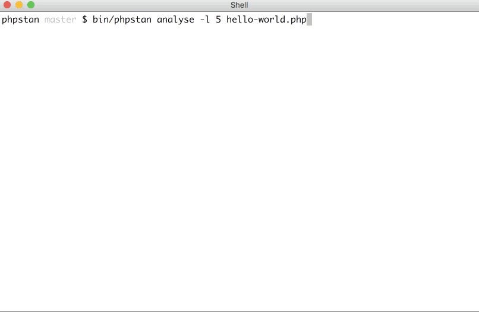
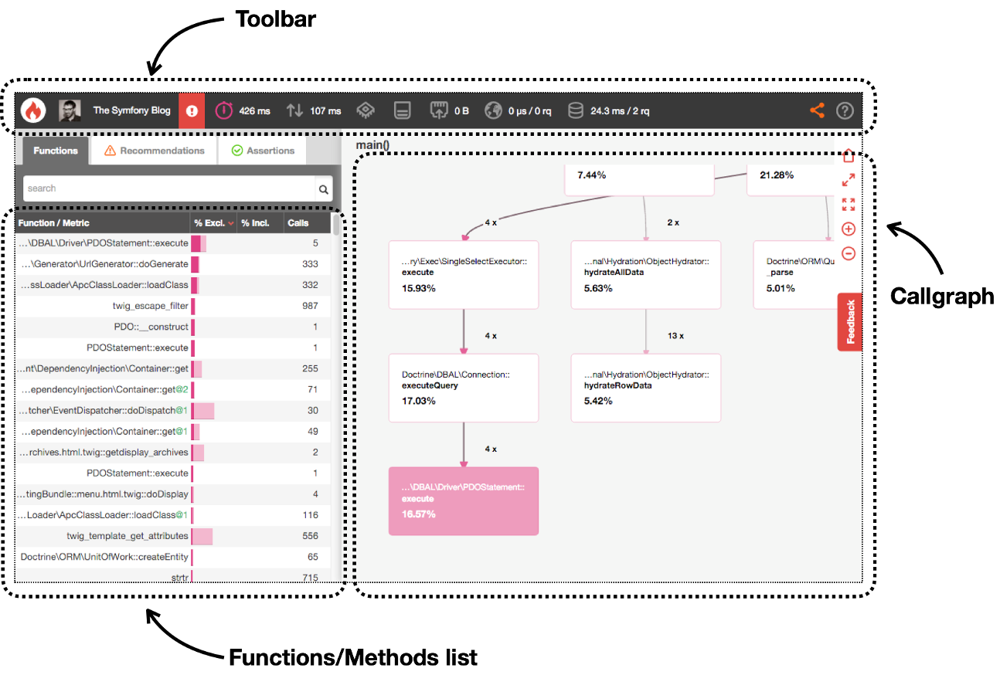

### Dependency management
  


### Web Application Framework

- Symfony (2005)
- Zend Framework (2006)
- Laravel (2011)


### Library
Cache / Config / Console / Dotenv / Form / Intl / Routing / Security / Validator / DependencyInjection / EventDispatcher / Workflow / Serializer / Filesystem / Finder / Yaml


### Testing

- Unit testing (PHPUnit / Atoum)
- Mocking (Prophecy) 
- BDD (Phpspec / Behat)
- Mutation Testing (Infection)


#### 12 Factor CLI

9 Be speedy  
_CLIs need to start quickly. Use $ time mycli to benchmark your CLI. Here is a rough guide_ :    

- <100ms: very fast (sadly, not feasible for scripting languages)
- 100ms–500ms: fast enough, aim here
- 500ms-2s: usable, but not going to impress anyone
- 2s+: languid, users will prefer to avoid your CLI at this point


#### Challenge accepted

```
$ time php cli-app 

Options:
  -h, --help            Display this help message
  -V, --version         Display this application version
  -n, --no-interaction  Do not ask any interactive question
  -v|vv|vvv, --verbose  Increase the verbosity of messages: 1 for normal output, 2 for more verbose output and 3 for debug

Available commands:
  greet  
  help   Displays help for a command

real  0m0,076s | user 0m0,065s | sys  0m0,012s
```


### PHP CS Fixer
```
composer global require friendsofphp/php-cs-fixer
```  
Git Hook (pre commit)
```bash
git status --porcelain | grep -e '^[AM]\(.*\).php$' | cut -c 3- | while read line; do
    ./vendor/bin/php-cs-fixer fix  --verbose "$line";
    git add "$line";
done
```


### PHPStan - PHP Static Analysis Tool



### Php Inspections (IntelliJ Plugin)
- architecture related issues
- weak types control and possible code construct simplifications
- performance issues
- non-optimal, duplicate and suspicious "if" conditions
- regular expressions
- compatibility issues
- variety of time-consuming bugs
- security issues


#### Blackfire  
 <!-- .element height="80%" width="80%" -->


### Async

- ReactPHP (Event Loop)
- Swoole (Coroutine)
- AMPHP
- RxPHP 


### 🎁 Hello world benchmark time 
#### NodeJS - Swoole

- Ubuntu 18.04.1 LTS (64 bit)
- Intel Core i7-8550U (1.80GHz - 8) 
- 16 Go DDR4 2400 MHz SODIMM


#### NodeJS
```
wrk -t12 -c400 -d30s http://127.0.0.1:8081

Running 30s test @ http://127.0.0.1:8081
  12 threads and 400 connections
  Thread Stats   Avg      Stdev     Max   +/- Stdev
    Latency    16.02ms    2.74ms 267.09ms   96.47%
    Req/Sec     2.06k   203.40     3.32k    87.65%
  735948 requests in 30.04s, 119.32MB read
Requests/sec:  24498.93
Transfer/sec:      3.97MB
```


#### Swoole
```
wrk -t12 -c400 -d30s http://127.0.0.1:9501

Running 30s test @ http://127.0.0.1:9501
  12 threads and 400 connections
  Thread Stats   Avg      Stdev     Max   +/- Stdev
    Latency     2.57ms    2.76ms  35.41ms   87.07%
    Req/Sec    16.45k     2.63k   47.42k    65.13%
  5901889 requests in 30.10s, 0.97GB read
Requests/sec: 196084.68
Transfer/sec:     33.10MB
```


 735948 * 8 = 5887584


## Thank you - Question ? 
- [Rasmus Lerdorf - PHP IN 2018](http://talks.php.net/phpce18#/)
- [Jeff Dickey - 12 Factor CLI Apps](https://medium.com/@jdxcode/12-factor-cli-apps-dd3c227a0e46)
- [Nikita Popov - PHP 7 Virtual Machine ](https://nikic.github.io/2017/04/14/PHP-7-Virtual-machine.html)
- [Joe Watkins - PHP allows for the design of X](http://blog.krakjoe.ninja/2018/05/php-allows-for-design-of-x.html)